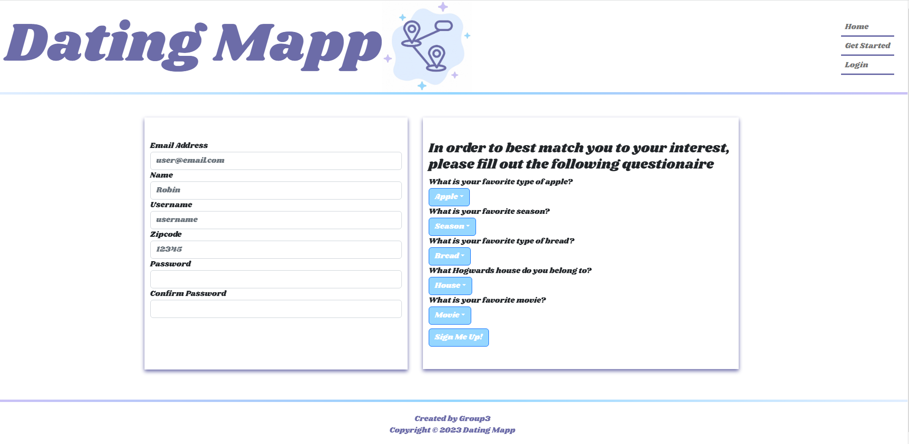
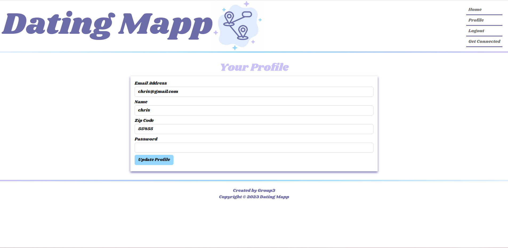
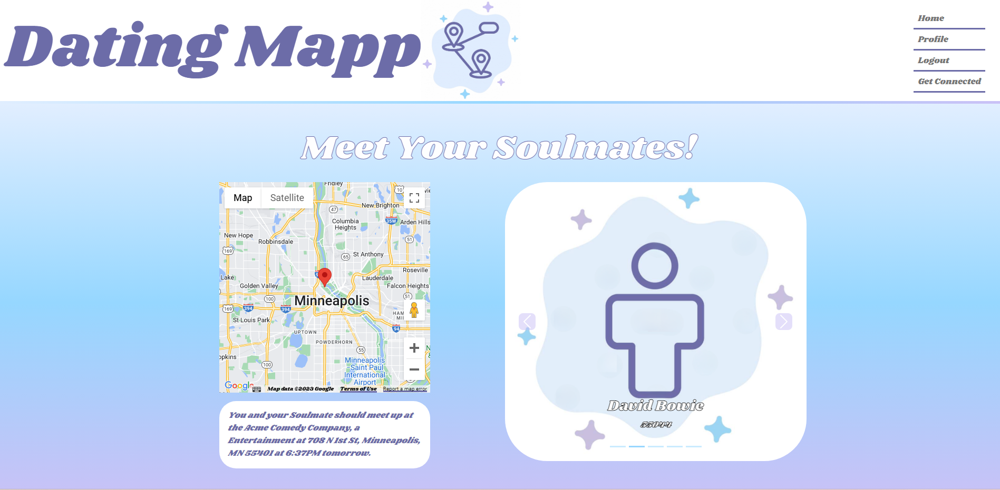

# Dating Mapp

## Badges

## Table of Contents

- [Description](#description)
- [Installation](#installation)
- [Usage](#usage)
- [Links](#links)
- [Credits](#credits)
- [License](#license)
- [Screenshots](#screenshots)

## Description

The purpose of this project was to work as a group to utilze many of the technologies we have learned over the past few months to create a full stack MERN application. Early on in our planning process we decided to develop a fun dating application that would match you up with your "Soul Mates" based on your interests and give the users a fun place to meet up using a Google Maps API. 

## Installation

To install NPM packages.
- npm install

To run locally.
- npm run develop

## Usage

- When you click on the link below to take you to The Dating Mapp application. 
- You will be then directed to the home page where you can click the "Get Started" link, or if you have already signed up you can click the "Login" link. 
- The "Get Started" link directs you to the signup page where you need to fill out all of your information as well as answering the questions by choosing options from the drop down menus. 
- You will then be taken to the "Get Connected" page where you will be matched with your "Soul Mates" and given a fun place to meet up.

## Links

[Click here to see the The Dating Mapp website.](https://the-dating-mapp.herokuapp.com/)

[Click here to see the The Dating Mapp repository.](https://github.com/strongjaw15/the-dating-mapp)

## Credits
- **Dani Bano**
- **Erik Neafus**
- **Greg Trahan**
- **Corin Wenger**
- **Christopher Clark**

## License

MIT License

Copyright 2023 Group3

Permission is hereby granted, free of charge, to any person obtaining a copy of this software and associated documentation files (the "Software"), to deal in the Software without restriction, including without limitation the rights to use, copy, modify, merge, publish, distribute, sublicense, and/or sell copies of the Software, and to permit persons to whom the Software is furnished to do so, subject to the following conditions:

The above copyright notice and this permission notice shall be included in all copies or substantial portions of the Software.

THE SOFTWARE IS PROVIDED "AS IS", WITHOUT WARRANTY OF ANY KIND, EXPRESS OR IMPLIED, INCLUDING BUT NOT LIMITED TO THE WARRANTIES OF MERCHANTABILITY, FITNESS FOR A PARTICULAR PURPOSE AND NONINFRINGEMENT. IN NO EVENT SHALL THE AUTHORS OR COPYRIGHT HOLDERS BE LIABLE FOR ANY CLAIM, DAMAGES OR OTHER LIABILITY, WHETHER IN AN ACTION OF CONTRACT, TORT OR OTHERWISE, ARISING FROM, OUT OF OR IN CONNECTION WITH THE SOFTWARE OR THE USE OR OTHER DEALINGS IN THE SOFTWARE.

## Screenshots

